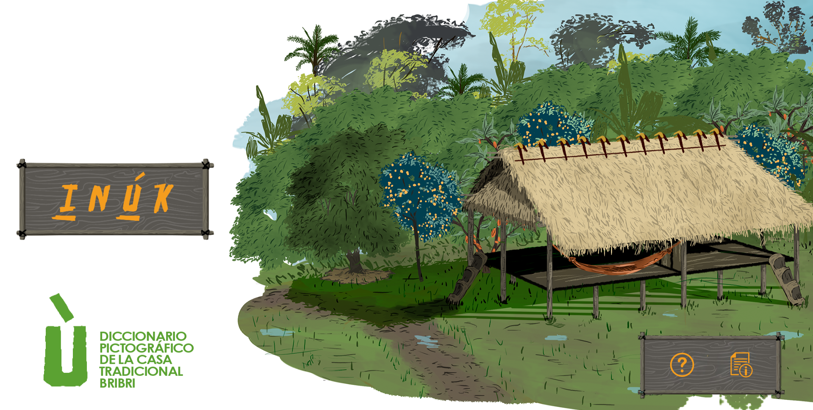

# JuegoCasaBribri

> Aplicación web educativa para el aprendizaje del idioma indígena Bribri mediante ejercicios interactivos de lectura, escucha y pronunciación.

## Información General

|                      |                                                          |
| -------------------- | -------------------------------------------------------- |
| **Nombre**           | CasaBribri                                               |
| **Versión**          | 2.0.0                                                    |
| **Framework**        | React Native con Expo                                    |
| **Package ID**       | com.alexander22.BriBriNew                                |
| **Versión del Sistema**   | 0.1.0                                                    |

---



> Para más información sobre la aplicación, léase [Sobre este Proyecto](./docs/project-context.md)

## Instalación y Configuración

### Prerrequisitos
- Node.js (versión LTS recomendada)
- npm o yarn
- Expo CLI (`npm install -g expo-cli`)
- Para desarrollo móvil:
  - Android Studio (para Android)
  - Xcode (para iOS, solo macOS)

### Instalación

1. **Clonar el repositorio:**
```bash
git clone https://github.com/lenguasytradiciones/Juego-casa-bribri-web
cd Juego-casa-bribri-web
```

2. **Instalar dependencias:**
```bash
npm install
```

3. **Iniciar servidor de desarrollo:**
```bash
npm start
```

> **Nota**: Para más información sobre la instalación y ejecución, véase la [Guía de Instalación y Despliegue](./docs/deploy-guide.md)

## Soporte y Contacto

- **Repositorio:** https://github.com/lenguasytradiciones/Juego-casa-bribri-web
- **Problemas/Issues:** [GitHub Issues](https://github.com/lenguasytradiciones/Juego-casa-bribri-web/issues)
- **Coordinador del Proyecto:** Luis Serrato Pineda dipalicori@ucr.ac.cr

---


## Notas Adicionales

### Orientación Landscape
La app está configurada para funcionar únicamente en modo horizontal (landscape). Esto está definido en `app.json`:
```json
"orientation": "landscape"
```

### Nueva Arquitectura de React Native
El proyecto tiene habilitada la nueva arquitectura:
```json
"newArchEnabled": true
```


**Última actualización:** 2026-07-24
